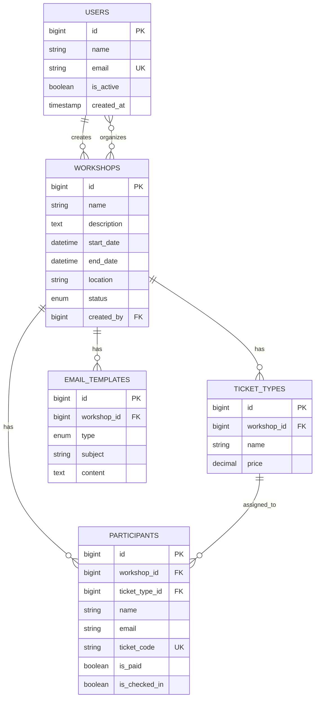

# Design Document

## Overview

The Internal Workshop Management System is a Laravel 12-based web application designed to manage internal workshops and courses. The system provides comprehensive functionality for user management with role-based permissions, workshop lifecycle management, participant handling, automated ticket distribution with QR codes, check-in processes, and analytics dashboard.

The system follows Laravel best practices with clean architecture, separation of concerns, and proper use of Laravel's built-in features including Eloquent ORM, Queue system, Mailable classes, and Blade templating.

## Architecture

### High-Level Architecture

The system follows a traditional MVC architecture with additional service layers:

```
┌─────────────────┐    ┌─────────────────┐    ┌─────────────────┐
│   Presentation  │    │    Business     │    │      Data       │
│     Layer       │    │     Logic       │    │     Layer       │
│                 │    │     Layer       │    │                 │
│ • Blade Views   │◄──►│ • Controllers   │◄──►│ • Models        │
│ • Forms         │    │ • Services      │    │ • Migrations    │
│ • Components    │    │ • Jobs          │    │ • Seeders       │
│                 │    │ • Mailables     │    │                 │
└─────────────────┘    └─────────────────┘    └─────────────────┘
         │                       │                       │
         └───────────────────────┼───────────────────────┘
                                 │
                    ┌─────────────────┐
                    │   External      │
                    │   Services      │
                    │                 │
                    │ • Queue System  │
                    │ • Mail Service  │
                    │ • File Storage  │
                    └─────────────────┘
```

### Technology Stack

- **Framework**: Laravel 12
- **Database**: SQLite (configurable to MySQL/PostgreSQL)
- **Queue**: Database driver (configurable to Redis)
- **Mail**: Laravel Mailable with SMTP
- **Authentication**: Laravel's built-in authentication
- **Authorization**: Spatie Laravel Permission
- **QR Code Generation**: SimpleSoftwareIO/simple-qrcode
- **Excel Import**: Maatwebsite/Laravel-Excel
- **Frontend**: Blade templates with Metronic theme integration
- **Styling**: Metronic Bootstrap 5 theme (located in public/demo1)
- **UI Components**: Metronic pre-built components and layouts

## Components and Interfaces

### Core Models

#### User Model
```php
class User extends Authenticatable
{
    use HasRoles, HasPermissions; // Spatie traits
    
    // Relationships
    public function organizedWorkshops(): BelongsToMany
    public function createdWorkshops(): HasMany
}
```

#### Workshop Model
```php
class Workshop extends Model
{
    // Attributes: name, description, start_date, end_date, location, status
    
    // Relationships
    public function ticketTypes(): HasMany
    public function participants(): HasMany
    public function emailTemplates(): HasMany
    public function organizers(): BelongsToMany
    public function creator(): BelongsTo
}
```

#### TicketType Model
```php
class TicketType extends Model
{
    // Attributes: name, price, workshop_id
    
    // Relationships
    public function workshop(): BelongsTo
    public function participants(): HasMany
}
```

#### Participant Model
```php
class Participant extends Model
{
    // Attributes: name, email, phone, occupation, address, company, position
    // ticket_code, is_paid, is_checked_in, workshop_id, ticket_type_id
    
    // Relationships
    public function workshop(): BelongsTo
    public function ticketType(): BelongsTo
    
    // Methods
    public function generateTicketCode(): string
    public function getQrCodeUrl(): string
}
```

#### EmailTemplate Model
```php
class EmailTemplate extends Model
{
    // Attributes: workshop_id, type, subject, content
    
    // Relationships
    public function workshop(): BelongsTo
    
    // Methods
    public function render(array $variables): string
}
```

### Service Classes

#### WorkshopService
```php
class WorkshopService
{
    public function createWorkshop(array $data): Workshop
    public function updateWorkshop(Workshop $workshop, array $data): Workshop
    public function deleteWorkshop(Workshop $workshop): bool
    public function getWorkshopStatistics(Workshop $workshop): array
}
```

#### ParticipantService
```php
class ParticipantService
{
    public function createParticipant(array $data): Participant
    public function importFromExcel(UploadedFile $file, Workshop $workshop): Collection
    public function generateTicketCode(): string
    public function sendTicketEmail(Participant $participant): void
    public function checkIn(string $ticketCode): Participant
}
```

#### QrCodeService
```php
class QrCodeService
{
    public function generateQrCode(string $ticketCode): string
    public function generateQrCodeUrl(string $ticketCode): string
    public function decodeQrCode(string $qrData): string
}
```

#### EmailService
```php
class EmailService
{
    public function sendTicketEmail(Participant $participant): void
    public function sendBulkEmails(Collection $participants, string $templateType): void
    public function renderTemplate(EmailTemplate $template, array $variables): string
}
```

### Controllers

#### WorkshopController
- Resource controller for CRUD operations
- Uses WorkshopService for business logic
- Handles workshop listing, creation, editing, deletion

#### ParticipantController
- Manages participant CRUD operations
- Handles Excel import functionality
- Manages ticket sending and resending

#### CheckInController
- Handles QR code scanning interface
- Processes check-in operations
- Provides check-in status updates

#### DashboardController
- Displays overview statistics
- Provides workshop analytics
- Generates reports

### Jobs (Queue)

#### SendTicketEmailJob
```php
class SendTicketEmailJob implements ShouldQueue
{
    public function handle(EmailService $emailService): void
    // Sends individual ticket emails
}
```

#### SendBulkEmailsJob
```php
class SendBulkEmailsJob implements ShouldQueue
{
    public function handle(EmailService $emailService): void
    // Sends bulk emails to multiple participants
}
```

### Mailables

#### TicketMailable
```php
class TicketMailable extends Mailable
{
    public function build(): self
    // Builds ticket email with QR code attachment
}
```

#### WorkshopNotificationMailable
```php
class WorkshopNotificationMailable extends Mailable
{
    public function build(): self
    // Builds various workshop notification emails
}
```

### Form Requests

#### WorkshopRequest
- Validates workshop creation and update data
- Handles date validation and business rules

#### ParticipantRequest
- Validates participant information
- Ensures email uniqueness within workshop

#### TicketTypeRequest
- Validates ticket type data
- Ensures pricing rules

## Data Models

### Database Schema

#### Users Table
```sql
CREATE TABLE users (
    id BIGINT PRIMARY KEY AUTO_INCREMENT,
    name VARCHAR(255) NOT NULL,
    email VARCHAR(255) UNIQUE NOT NULL,
    email_verified_at TIMESTAMP NULL,
    password VARCHAR(255) NOT NULL,
    is_active BOOLEAN DEFAULT TRUE,
    remember_token VARCHAR(100) NULL,
    created_at TIMESTAMP NULL,
    updated_at TIMESTAMP NULL,
    INDEX idx_email (email),
    INDEX idx_is_active (is_active)
);
```

#### Workshops Table
```sql
CREATE TABLE workshops (
    id BIGINT PRIMARY KEY AUTO_INCREMENT,
    name VARCHAR(255) NOT NULL,
    description TEXT NULL,
    start_date DATETIME NOT NULL,
    end_date DATETIME NOT NULL,
    location VARCHAR(255) NOT NULL,
    status ENUM('draft', 'published', 'ongoing', 'completed', 'cancelled') DEFAULT 'draft',
    created_by BIGINT NOT NULL,
    created_at TIMESTAMP NULL,
    updated_at TIMESTAMP NULL,
    FOREIGN KEY (created_by) REFERENCES users(id) ON DELETE CASCADE,
    INDEX idx_status (status),
    INDEX idx_start_date (start_date),
    INDEX idx_created_by (created_by)
);
```

#### Workshop_Organizers Table (Pivot)
```sql
CREATE TABLE workshop_organizers (
    id BIGINT PRIMARY KEY AUTO_INCREMENT,
    workshop_id BIGINT NOT NULL,
    user_id BIGINT NOT NULL,
    created_at TIMESTAMP NULL,
    updated_at TIMESTAMP NULL,
    FOREIGN KEY (workshop_id) REFERENCES workshops(id) ON DELETE CASCADE,
    FOREIGN KEY (user_id) REFERENCES users(id) ON DELETE CASCADE,
    UNIQUE KEY unique_workshop_organizer (workshop_id, user_id)
);
```

#### Ticket_Types Table
```sql
CREATE TABLE ticket_types (
    id BIGINT PRIMARY KEY AUTO_INCREMENT,
    workshop_id BIGINT NOT NULL,
    name VARCHAR(255) NOT NULL,
    price DECIMAL(10,2) NOT NULL DEFAULT 0.00,
    created_at TIMESTAMP NULL,
    updated_at TIMESTAMP NULL,
    FOREIGN KEY (workshop_id) REFERENCES workshops(id) ON DELETE CASCADE,
    INDEX idx_workshop_id (workshop_id)
);
```

#### Participants Table
```sql
CREATE TABLE participants (
    id BIGINT PRIMARY KEY AUTO_INCREMENT,
    workshop_id BIGINT NOT NULL,
    ticket_type_id BIGINT NOT NULL,
    name VARCHAR(255) NOT NULL,
    email VARCHAR(255) NOT NULL,
    phone VARCHAR(20) NULL,
    occupation VARCHAR(255) NULL,
    address TEXT NULL,
    company VARCHAR(255) NULL,
    position VARCHAR(255) NULL,
    ticket_code VARCHAR(50) UNIQUE NOT NULL,
    is_paid BOOLEAN DEFAULT FALSE,
    is_checked_in BOOLEAN DEFAULT FALSE,
    checked_in_at TIMESTAMP NULL,
    created_at TIMESTAMP NULL,
    updated_at TIMESTAMP NULL,
    FOREIGN KEY (workshop_id) REFERENCES workshops(id) ON DELETE CASCADE,
    FOREIGN KEY (ticket_type_id) REFERENCES ticket_types(id) ON DELETE CASCADE,
    UNIQUE KEY unique_workshop_email (workshop_id, email),
    INDEX idx_ticket_code (ticket_code),
    INDEX idx_workshop_id (workshop_id),
    INDEX idx_is_paid (is_paid),
    INDEX idx_is_checked_in (is_checked_in)
);
```

#### Email_Templates Table
```sql
CREATE TABLE email_templates (
    id BIGINT PRIMARY KEY AUTO_INCREMENT,
    workshop_id BIGINT NOT NULL,
    type ENUM('invite', 'confirm', 'ticket', 'reminder', 'thank_you') NOT NULL,
    subject VARCHAR(255) NOT NULL,
    content TEXT NOT NULL,
    created_at TIMESTAMP NULL,
    updated_at TIMESTAMP NULL,
    FOREIGN KEY (workshop_id) REFERENCES workshops(id) ON DELETE CASCADE,
    UNIQUE KEY unique_workshop_template_type (workshop_id, type),
    INDEX idx_workshop_id (workshop_id),
    INDEX idx_type (type)
);
```

### Model Relationships



## Error Handling

### Exception Handling Strategy

#### Custom Exceptions
```php
class WorkshopNotFoundException extends Exception {}
class ParticipantAlreadyExistsException extends Exception {}
class InvalidTicketCodeException extends Exception {}
class EmailSendingFailedException extends Exception {}
```

#### Global Exception Handler
- Log all exceptions with context
- Return appropriate HTTP status codes
- Provide user-friendly error messages
- Handle validation errors gracefully

#### Validation Error Handling
- Use Form Requests for input validation
- Return validation errors with field-specific messages
- Maintain form state on validation failure

#### Queue Job Error Handling
- Implement retry logic for failed jobs
- Log failed job details
- Provide manual retry mechanisms
- Send notifications for critical failures

## Testing Strategy

### Unit Testing
- Test all service classes with mocked dependencies
- Test model relationships and methods
- Test validation rules and business logic
- Test QR code generation and decoding

### Feature Testing
- Test complete user workflows
- Test API endpoints and responses
- Test email sending functionality
- Test file upload and import features

### Integration Testing
- Test database interactions
- Test queue job processing
- Test email template rendering
- Test permission and role enforcement

### Browser Testing (Optional)
- Test critical user interfaces
- Test QR code scanning functionality
- Test responsive design elements
- Test JavaScript interactions

### Test Data Management
- Use factories for consistent test data
- Implement database transactions for test isolation
- Create realistic test scenarios
- Mock external services appropriately

### Performance Testing
- Test with large datasets
- Monitor query performance
- Test concurrent user scenarios
- Validate queue processing efficiency